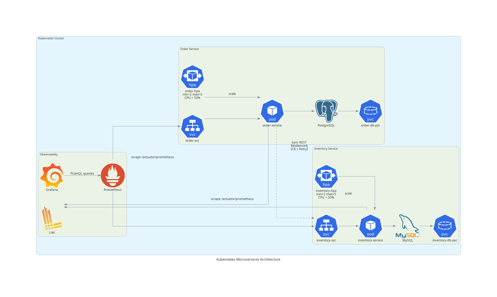

# Kubernetes Deployment: Order & Inventory Services


## Quick Start
```bash
kubectl apply -k overlays/dev/
```

## What You Need
- Kubernetes cluster
- Docker images for both services [Inventory Service](https://github.com/entropywhisperer/microservice-landscape-inventory-service) and [Order Service](https://github.com/entropywhisperer/microservice-landscape-order-service)
- Update image names in `base/order/deployment.yaml` and `base/inventory/deployment.yaml`

## Cleanup
```bash
kubectl delete -k overlays/dev/
```

## License

Licensed under the **MIT License**. See the [`LICENSE`](LICENSE) file for details.